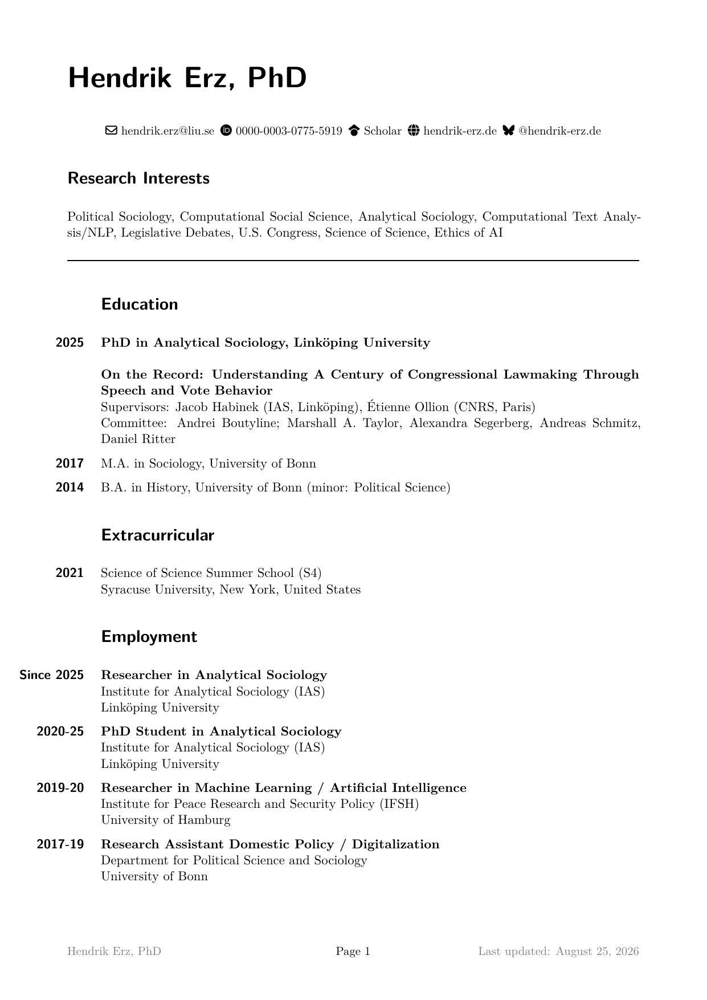

# Curriculum Vitae LaTeX Template

> I use this CV template to create my own CV, and so can you. It involves three
> steps: (1) download the CV data and template files; (2) edit the data;
> (3) export as an organized PDF CV.

[Take me right to the instructions](#how-to-use)!

## Preview

When everything is set up, the CV can look like this:



## Why Yet Another CV Template?

CV templates are legion in our times, but their quality is often far and wide
between. A CV should be simple, expressive, and, most importantly, quick to set
up. Most CV templates come either as Word processing files (for usage with Word,
Google Docs, etc.), or, if you want to go more technical, as plain LaTeX
templates.

This repository fills the middle ground: Provide the data using a Markdown file
so that it's super simple to keep up-to-date, but then pass it through LaTeX to
generate a high-quality, professional CV template. Tabular, minimal, and modern.

You might ask why I saw it necessary to create yet another CV template, when the
internet is littered with them? Good question! There are a few reasons why I
chose this road:

- **Pandoc-Compatible**: Most templates are designed to work with LaTeX
  directly, but I personally prefer Pandoc, since Markdown (and the accompanying
  data structures) are just much cleaner than raw TeX source.
- **Single-File-Template**: Even those templates that can work with Pandoc still
  have quite a lot of files coming with them, and I prefer (at least for simple
  projects such as a CV) a single-file template.
- **Few Dependencies**: We’re talking about a CV here, whose main aims are to be
  readable and minimalistic. Many templates I’ve seen had me install quite a few
  additional packages. This template tries to be modest in this regard.
- **Straight-forward data structures**: A CV is basically a PDF-version of an
  Excel spreadsheet of your life. Whenever something changes, do you really want
  to add the whole boilerplate code just for that one new employment? By making
  use of Pandoc’s YAML frontmatters, we can do all of this with much less code.
- **Learning**: The least-important reason from your perspective is that I like
  to try out stuff. This CV proved a good opportunity to freshen up my knowledge
  of TeX, Pandoc templates, and the whole process of crafting a final PDF file.

## How To Use

### Step 1: Getting the Files

The first step is to either fork this repository, or to download it to your
computer. Forking has the benefit that you can edit the CV data from your
browser, downloading will be cleaner.

You need to download only two files: The `CV.md` which contains the data, and
the `cv.template.tex` file that contains the template. If you also want to
produce an HTML version (e.g., to include on your personal webpage), also
download the file `cv.template.htm`.

> [!CAUTION]
> If you fork the repository and then adjust the data in `CV.md`, this will lead
> to merge conflicts once you sync your fork with mine to fetch any updates.
> There are two solutions to this:
> 1. If you feel comfortable with the git command line, you can resolve the
>    merge conflicts by retaining all *your* changes to CV.md, while accepting
>    all changes to the other files.
> 2. Just copy the file `CV.md` to some other file, in which case you can run
>    Pandoc on that other file name and get exactly the same results, sans all
>    of this hassle.

### Step 2: Adding Your Data

After downloading the files, you'll want to edit the file `CV.md` (see the
caution above for caveats). It includes my data which should give you a preview
of what you can do. Change this data to include yours instead of mine. I have
attempted to keep its structure as simple as possible. Most of the action
happens in the YAML frontmatter of the file. There are two types of data
structures that you can use:

- General metadata (name, occupation, address, and some templating stuff)
- Sections with the actual data

Some general notes: Most fields can contain Markdown syntax. Additionally, a lot
of the properties allow multiple lines of text. In order to do so, provide a
list of strings, which will automatically be delimited with a `\newline` in the
output. Lastly, you can leave out most properties and they will fall back to
sensible defaults or just not render (e.g., you can leave out the address
entirely).

Finally, after your data in the frontmatter, you can write some general Markdown
which will be included in the CV template after the address/contact blocks, but
before the sections. Use this to customize your CV further. I am using this to
list my research interests. Do not add any Markdown to the `CV.md` file to
immediately start with the sections.

### Step 3: Create the PDF

The last step is to compile the CV to PDF using Pandoc. This repository contains
a GitHub Actions workflow, so you can do this directly on GitHub. Please refer
to [.github/workflows/main.yml](.github/workflows/main.yml) to see how it works.

To compile the CV into PDF, use the following command:

```bash
pandoc --output=CV.pdf --pdf-engine=xelatex --template=cv.template.tex CV.md
```

To compile the HTML version of the CV, run:

```bash
pandoc --output=CV.stub.html --embed-resources --template=cv.template.htm CV.md
```

> [!NOTE]
> Change `CV.md` to whichever file name you decided to use (see the caution note
> above). Also, this step requires a bunch of additional packages and
> dependencies that you will only need to install once. Refer to the GitHub
> Actions workflow file to see what the requirements are.

## Reference

The following YAML frontmatter properties are supported for this particular
template:

* `name`: Required, will form the title of the CV.
* `occupation`: Optional, current occupation. Prominently displayed between your
  name and the `address`/`contact`-block.
* `address`: Optional, used to include your (work) address. Accepts a list of
  strings, one per line. If this property is present, the template will use two
  columns, with the address left and the contact options right. If you leave
  this out but provide any contact option, the contact options will be displayed
  in a single line centered on the page.
* `contact`: An object to include contact options to include. Supported
  properties:
    * `email`: Your email address, as-is.
    * `phone`: Your phone, will be linked using a `tel:` link.
    * `orcid`: Your ORCID. Will be correctly linked. Provide only the ID itself.
    * `scholar`: Your Google scholar profile. Provide only the `user` string
      from the profile.
    * `website`: Your website link. Provide the full link including `https`.
    * `website_title`: If your website is `https://www.example.com/` but you
      want it to display as `example.com`, provide this property accordingly.
    * `bluesky`: Your Bluesky handle. Do not provide the full link.
    * `twitter`: Your Twitter handle. Do not provide the full link.
    * `mastodon`: Your Mastodon link. This time it must be the full link.
    * `mastodon_title`: Same as with the website, can be used to control the
      display value of the link.
* `accentColor`: Optional, provides the accent color in RGB values (default:
  `0.5,0.0,0.4`).
* `textColor`: Optional, provides the regular text color in RGB values (default:
  `0.2,0.2,0.2`).
* `mutedColor`: Optional, a muted color that is used, e.g., for the footer
  (default: `0.5,0.5,0.5`).
* `mainfont`: The font family to be used for the main text body. Default: The
  LaTeX default serif font. Must be installed.
* `sansfont`: The font family to be used for special text (such as headings and
  the labels of the CV). Default: The LaTeX default sans serif font. Must be
  installed.
* `labelmargin`: Optional, can be used to increase or decrease the margins in
  which the template places the labels. The default of `3cm` has been validated
  for use with up to 10 characters in variable-length fonts. I recommend to keep
  this as narrow as possible, but if you absolutely need to, you can adjust it
  here. If the labelmargin is too narrow, text will be cut off.
* `sections`: A list of sections. Each section must have a `title` (e.g.,
  "Education"), and a list of `items`. Each item can have the following
  properties:
  * `label`: Will be shown in the left margin. Use this for years. Examples:
    2024; 2022-2024; Since 2025. The amount of space available is determined by
    `labelmargin`, the color used for the labels is the accent color. Optional.
  * `text`: Either a single line of text, or a list of strings, one per line.

### But What About My Publications?!

That’s a good question. Almost *everybody* nowadays simply provides a
`.bib`-file containing their publications which will just be pushed into the
final CV. However, I think that is not the easiest way. The main reason for this
is that your CV is not a paper of yours, so the list of publications looks
different. After all, your publication list will look suspiciously fishy since
there’s one person _always_ involved. So for your CV, different rules than for
citing in a paper apply. First, the publications should be sorted by publication
date descending. Second, depending on how it would look, you probably wanna
leave out the “author” field, since – even though everyone knows these are
_your_ publications – your name repeated for thirty items will look weird. And
lastly, you may wanna leave out … let’s say, less fortunate texts. With YAML you
can simply comment out certain items. Try that with a CSL JSON database or Bib:
Much more tricky!

Plus, even though it _is_ quite the effort to get your list of publications in
there for the first time, afterwards it’s just about correcting a few things
here and there.

> [!NOTE]
> There will certainly be links inside your references. Make sure to surround
> them with `\\url{}`. The reason is that Pandoc uses slightly different syntax
> to auto-link these which will look extremely ugly. I’ve configured `\url{}` to
> look good, but not the Pandoc version. Plus, note the double-backslash. A
> single is not enough.

## License

Since it wasn’t that much effort and since attribution with CVs is pretty
difficult anyways, I hereby license the template file (obviously not my personal
data!) using
[CC0 1.0 Universal](https://creativecommons.org/publicdomain/zero/1.0/). That
means: you can just use the template however you like. But please don’t
impersonate me in your applications/on your website.

**I’d be pretty happy if you could give me a [shoutout on Bluesky](https://bsky.app/profile/hendrik-erz.de) if you found that template useful. ❤️**
