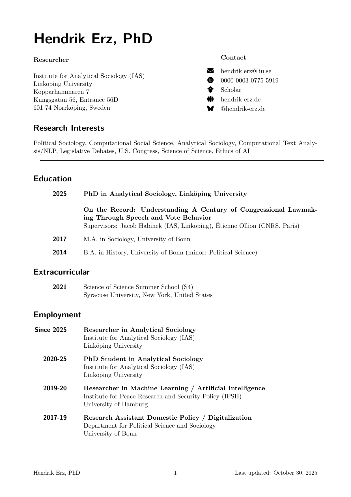

# Curriculum Vitae LaTeX Template

> I use this CV template to create my own CV, and so can you. It involves three steps: (1) clone this repository; (2) edit the data; (3) export as an organized PDF CV.

## Preview

When everything is set up, the CV can look like this:



## Why Yet Another CV Template?

While I never especially liked Microsoft Word, I was especially annoyed by it after many years of exclusively writing in Markdown when I had to use it because I had no CV template set up but was under the pressure of a deadline. Several times throughout the process of writing that CV from scratch in Word the thought did occur to me to murder something. Because such thoughts are never good for one's blood pressure, I finally took the challenge to create my very own CV template, which you can find in this repository.

[Take me right to the instructions](#how-to-use)!

You might ask why I saw it necessary to create yet another CV template, when the internet is littered with them? Good question! There are a few reasons why I chose this road:

- **Pandoc-Compatible**: Most templates are designed to work with LaTeX directly, but I personally prefer Pandoc, since Markdown (and the accompanying data structures) are just much cleaner than raw TeX source.
- **Single-File-Template**: Even those templates that can work with Pandoc still have quite a lot of files coming with them, and I prefer (at least for simple projects such as a CV) a single-file template.
- **Few Dependencies**: We’re talking about a CV here, whose main aims are to be readable and minimalistic. Many templates I’ve seen had me install quite a few additional packages. This template tries to be modest in this regard.
- **Straight-forward data structures**: A CV is basically a PDF-version of an Excel spreadsheet of your life. Whenever something changes, do you really want to add the whole boilerplate code just for that one new employment? By making use of Pandoc’s YAML frontmatters, we can do all of this with much less code.
- **Learning**: The least-important reason from your perspective is that I like to try out stuff. This CV proved a good opportunity to freshen up my knowledge of TeX, Pandoc templates, and the whole process of crafting a final PDF file.

But now you certainly want to get started, right? So let’s see how!

## How To Use

### Step 1: Getting the Files

The first step is to either fork this repository, or to download it to your computer. Forking has the benefit that you can edit the CV data from your browser, downloading may be a bit cleaner.

You need to download only two files: The `CV.md` which contains the data, and the `cv.template.tex` file that contains the template.

> [!TIP]
> The repository also contains the necessary files for rendering the CV data into an HTML template. If you want to, e.g., also display an HTML version of your CV on your website, also make sure to download the `cv.template.htm` file that contains the HTML stub template. If you want the HTML export, too, simply run `pandoc --output=CV.html --template=cv.template.htm CV.md` to generate the HTML version.

### Step 2: Adding Your Data

After downloading the files, you'll want to edit the file `CV.md`. It includes my data which should give you a preview of what you can do. Change this data to include yours instead of mine. I have attempted to keep its structure as simple as possible. There are two types of data that you can use:

- General metadata (name, occupation, address, and some templating stuff)
- Sections with the actual data

Some general notes: Most fields can contain Markdown code so that you can, e.g., emphasise certain portions of text. Additionally, a lot of the properties allow multiple lines of text. In order to do so, provide a list of strings. They will be delimited by `\newline` in the output. Of course, you can just add a single string in the property if you don’t want multiple lines. Lastly, if you don’t need something, you can basically leave off the property and the template should still compile.

Lastly, I should mention that you can add some sections that do not fit the list-like style of the rest of the CV. I personally use that to add my research interests, but you might add something else. Whatever is the actual contents of your Markdown document (not the YAML frontmatter) will be displayed as-is between the occupation/address/contact header and the horizontal ruler that divides that from the tabular data.

### Step 3: Create the PDF

The last step is to compile the CV to PDF. This repository contains a GitHub Actions workflow, so you can do this directly on GitHub. This way whenever you change anything regarding the data, GitHub will automatically compile the updated PDF file for you. The command that it runs is the following:

```
pandoc --output=CV.pdf --pdf-engine=xelatex --template=cv.template.tex CV.md
```

> [!TIP]
> The Actions workflow will install the following required Ubuntu packages. These may differ if you want to export locally on Windows or macOS. Refer to the Pandoc and LaTeX manuals in this case.
>
> `sudo apt install pandoc fonts-roboto texlive-base texlive-xetex texlive-latex-extra texlive-lang-english`

## Reference

In order to save space, here’s just some YAML code where I commented all possible values that you can use in the frontmatter and how you can use them:

```yaml
# The name is required. It is used as the main heading as well as in a few
# other places.
name: Hendrik Erz
# The accent color allows you to customise the accent colour. It has the format
# r,g,b where each colour component can range from 0.0 to 1.0 (not 0-255!).
accentColor: 0.5,0.0,0.4
# The text color is used wherever accentColor isn't.
textColor: 0.2,0.2,0.2
# The "main" font is what will be used for basically all the regular text.
# You'll get an error if LaTeX cannot find the font on your computer.
mainfont: Roboto
# The "sans" font will be used, e.g., for headings and other non-main-text-body
# text. Based on my own experiences, I strongly suggest you do NOT choose two
# different fonts, and also (since your CV is almost guaranteed never printed)
# a sans-serif font.
sansfont: Roboto
# The occupation is the bold-printed first line above your address.
occupation: PhD Student
# Address is pretty much just a few lines that will be added below occupation.
# This means, if you don't want your address, feel free to add a quote or
# something. Or, leave it out completely!
# Remember: each list item is one line.
address:
  - Institute for Analytical Sociology # Imagine a "\newline" here
  - Linköping University # Same
  - 601 74 Norrköping, Sweden # No newline here.
# "Contact" is also basically just a list of strings which you can omit
# if you don't want to be contacted.
# NOTE: These properties will all be wrapped in "\url{}"!
contact:
  - hendrik.erz@liu.se
  - https://www.hendrik-erz.de/
# Now follows the main portion.
# sections takes a list of -- you guessed it: sections! Each section
# has a title, which will be -- you again guessed it: the title of it.
sections:
  - title: Education
    # A second property is "items". Items is a list of list items.
    items:
        # The "label" will be written in the accent colour to the left.
        # You can also leave off "label" completely and only provide the
        # "text" property. In that case, the text will be correctly aligned
        # with the other texts but has no label. You can make use of this
        # for subsections (see the CV.md for examples).
      - label: Since 2020
        # Text will be in the default text colour on the right.
        # You can also provide a list of strings here (just like with address
        # and contact) and the strings will be written with a "\newline"
        # command.
        text: PhD in Analytical Sociology, Linköping University
      - label: 2017
        text: M.A. in Sociology, University of Bonn
      - label: 2014
        # Make sure to escape strings which contain reserved characters.
        text: "B.A. in History, University of Bonn (minor: Political Science)"
# ... add as many sections with as many items as you like!
```

### But What About My Publications?

That’s a good question. Almost _everybody_ nowadays simply provides a `.bib`-file containing their publications which will just be pushed into the final CV. However, I think that is not the easiest way. The main reason for this is that your CV is not a paper of yours, so the list of publications looks different. After all, your publication list will look suspiciously fishy since there’s one person _always_ involved. So for your CV, different rules than for citing in a paper apply. First, the publications should be sorted by publication date descending. Second, depending on how it would look, you probably wanna leave out the “author” field, since – even though everyone knows these are _your_ publications – your name repeated for thirty items will look weird. And lastly, you may wanna leave out … let’s say, less fortunate texts. With YAML you can simply comment out certain items. Try that with a CSL JSON database or Bib: Much more tricky!

Plus, even though it _is_ quite the effort to get your list of publications in there for the first time, afterwards it’s just about correcting a few things here and there.

> One final note, though! There will certainly be links inside your references. Make sure to surround them with `\\url{}`. The reason is that Pandoc uses slightly different syntax to auto-link these which will look extremely ugly. I’ve configured `\url{}` to look good, but not the Pandoc version. Plus, note the double-backslash. A single is not enough!

## License

Since it wasn’t that much effort and since attribution with CVs is pretty difficult anyways, I hereby license the template file (obviously not my personal data!) using [CC0 1.0 Universal](https://creativecommons.org/publicdomain/zero/1.0/). That means: you can just use the template however you like. But please don’t impersonate me in your applications/on your website.

**I’d be pretty happy if you could give me a [shoutout on Bluesky](https://bsky.app/profile/hendrikerz.bsky.social) if you found that template useful. ❤️**
